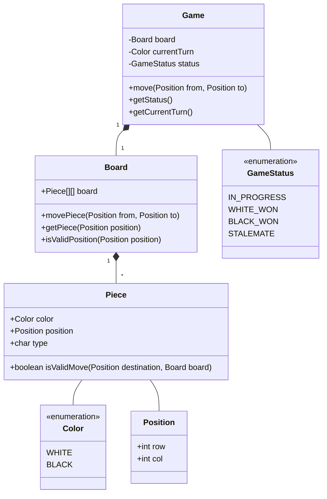

Design Chess Game

requirements:

uml :

```mermaid
classDiagram
    class Piece {
        +Color color
        +Position position
        +char type
        +boolean isValidMove(Position destination, Board board)
    }

    class Board {   
        +Piece[][] board
        +movePiece(Position from, Position to)
        +getPiece(Position position)
        +isValidPosition(Position position)
    }

    class Game {
        -Board board
        -Color currentTurn
        -GameStatus status
        +move(Position from, Position to)
        +getStatus()
        +getCurrentTurn()
    }

    class GameStatus {
        <<enumeration>>
        IN_PROGRESS
        WHITE_WON
        BLACK_WON
        STALEMATE
    }

    class Position {
        +int row
        +int col
    }

    class Color {
        <<enumeration>>
        WHITE
        BLACK
    }

    Board "1" *-- "*" Piece
    Game "1" *-- "1" Board
    Piece -- Color
    Piece -- Position
    Game -- GameStatus
```