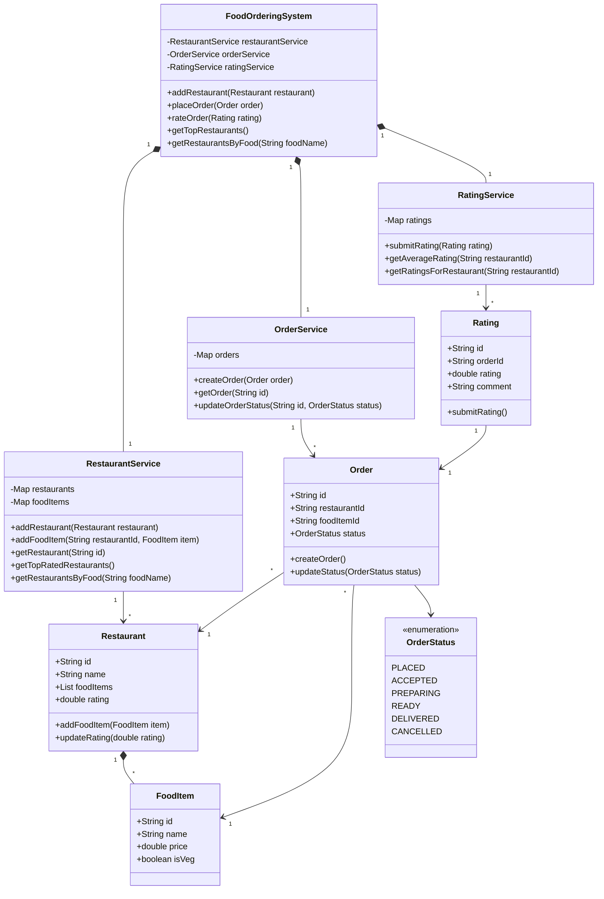

requirements:
- add restaurant
- add food item to restaurant
- order food
- rate order
- get top restaurants by food
- get top-rated restaurants

design:
- use a map to store restaurants
- use a map to store food items
- use a map to store orders
- use a map to store ratings
- use a map to store restaurant ratings

uml:

