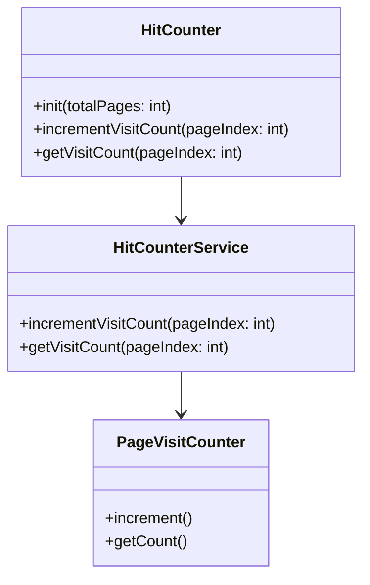

requirements:
- create a hit counter service that can be used to count the number of visits to a page
- the hit counter service should be able to be initialized with the total number of pages
- the hit counter service should be able to increment the visit count for a page
- the hit counter service should be able to get the visit count for a page

considerations:
- the hit counter service should be thread safe
- the hit counter service should be able to handle a large number of visits
- the hit counter service should be able to handle a large number of pages
- the hit counter service should be able to handle a large number of threads
- the hit counter service should be able to handle a large number of requests

uml:

